```{r setup, include=FALSE}
knitr::opts_chunk$set(echo = FALSE,message = F,warning = F)

run_full <- FALSE

if(run_full){
  library(timevis)
  library(tidyverse)
  library(lubridate)
  library(sf)
  library(janitor)
  library(swissvector4r)
  library(kableExtra)
  library(broom)
  library(swissrastermaps4r)
  library(RStoolbox)
  
  swissrastermaps4r::fdir_import("C:/Users/rata/Geodata/01_Switzerland/01_Maps/fdir.Rda")
  
  
  data("landesgebiet")
  data("kantonsgebiet")
  zhaw_blue1 <- rgb(0,100,166,maxColorValue = 255)
  zhaw_blue2 <- rgb(0,44,90,maxColorValue = 255)
  
  zhaw_grad <- scales::seq_gradient_pal(zhaw_blue1,zhaw_blue2)(seq(0,1,length.out=3))
  
  lims_bbox <- function(x) {
    if (!inherits(x, "sf") && !inherits(x, "sfc")) {
      stop("x is not an sf object!", call. = FALSE)
    }
    bbox <- sf::st_bbox(x)
    ggplot2::lims(
      x = unname(bbox[c("xmin", "xmax")]),
      y = unname(bbox[c("ymin", "ymax")])
    )
  }
} else{
  library(readr)
  library(dplyr)
  library(knitr)

}

```

```{r}

```


# Inhalt

- Rückblick TubeCam
- Schwerpunkte 2019/2020
  - Weiterentwicklung Nachweismethodik
  - Angepasstes Versuchdesign Erfolgskontrolle
  - Räuber-Beute Dynamik
  - Erhebung von Kleinstrukturen LiDAR
  - Nistkastenmonitoring


# Rückblick TubeCam

- Rückblick TubeCam
- Schwerpunkte 2019/2020
  - Weiterentwicklung Nachweismethodik
  - Angepasstes Versuchdesign Erfolgskontrolle
  - Räuber-Beute Dynamik
  - Erhebung von Kleinstrukturen LiDAR
  - Nistkastenmonitoring


## Ausangslage (2016)

Aktuell ist der Nachweis von Kleinmusteliden sehr aufwendig 

> - Spurentunnel sind schwer transportierbar
> - Tinte aufwendig in der Herstellung / Lagerung
> - Wöchentliche Besuche im Feld nötig
> - Ausfälle durch Witterung (Regenfälle / Trockenheit)
> - Auswertung benötigt viel Erfahrung / Expertenwissen 
> - Daten sind von geringer Auflösung (nur Präsenzdaten)
> - Daten lassen sich schwer Teilen und Archivieren

## Entscheid (2016)

Entwicklung einer Nachweismethodik mit folgenden Zielen:

> - Geringerer Zeitaufwand und geringere Gesamtkosten
> - Höhere Datenqualität und grössere Wissensausbeute
> - Tierschutzgerecht
> - Ermöglicht zuverlässige Datenerhebung und -auswertung durch Laien


## Vision

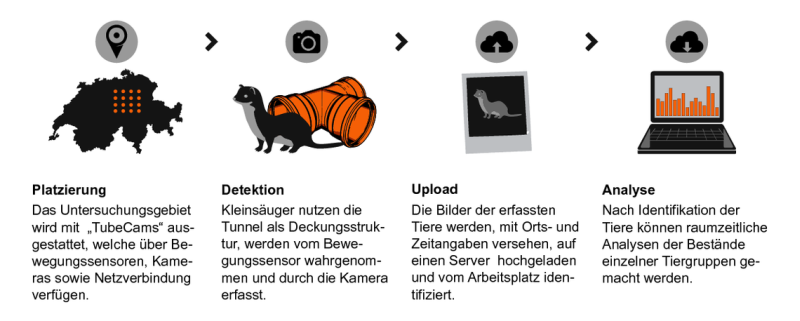

## Zeitplan

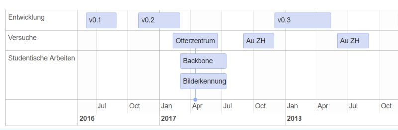


```{r, eval = F}


if(run_full){
  data <- read_delim("Zeitplan.csv",";", locale = locale(encoding = "Windows-1252")) %>%
  mutate(
    start = parse_date(start,format = "%d.%m.%Y"),
    # start = strftime(start),
    end = parse_date(end,format = "%d.%m.%Y"),
    # end = strftime(end)
    ) %>% 
  filter(!is.na(content))


group <- read_delim("groups.csv",";", locale = locale(encoding = "Windows-1252"))


data %>%
  timevis(groups = group)
}

```


## Otterzentrum Hankensbüttel
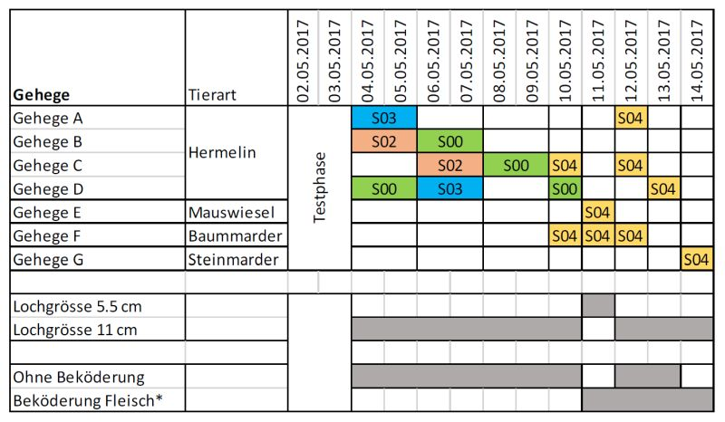


## Otterzentrum Hankensbüttel
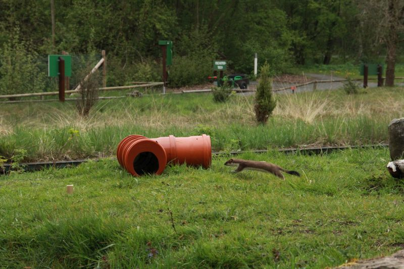


## Otterzentrum Hankensbüttel
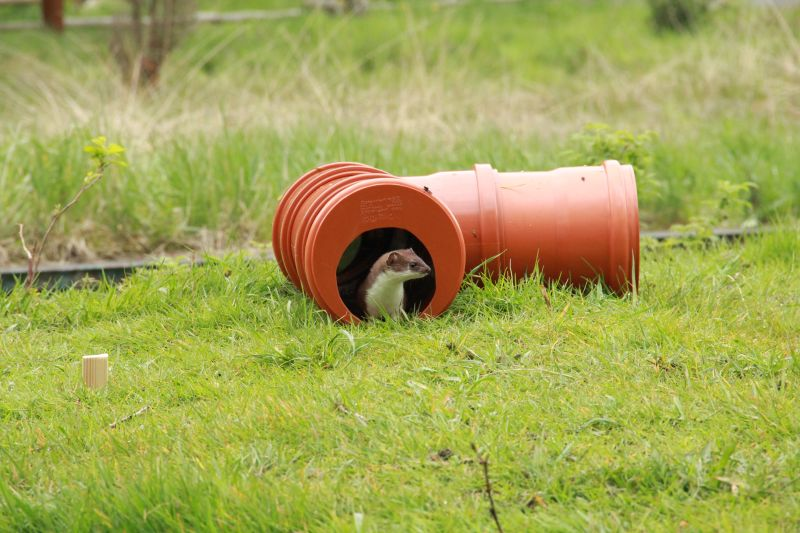


## Otterzentrum Hankensbüttel
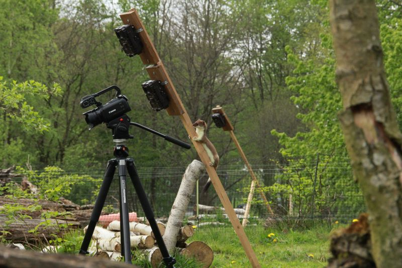


## Otterzentrum Hankensbüttel


```{r}
if(run_full){
  protokoll <- read_delim("Data/2017_SA2_Straub//Ereignisprotokoll.csv",";")

  
  protokoll <- protokoll %>%
    mutate(
      start = as.POSIXct(paste(Datum,von),format = "%d.%m.%Y %H:%M:%S"),
      end = as.POSIXct(paste(Datum,bis),format = "%d.%m.%Y %H:%M:%S")
    )
  
  format_hour <- function(hour_dec){
    full_hour <- hour_dec %/% 1
    partial_hour <- hour_dec %% 1
    paste(full_hour,partial_hour*60,sep = ":")
  }
  
  round_fac <- 0.5
  
  protokoll_smry <- protokoll %>%
    filter(Tierart == "Hermelin") %>%
    mutate(
      h = hour(start) + minute(start)/60,
      h = round(h/round_fac)*round_fac
    ) %>%
    group_by(h) %>%
    summarise(
      sum = n()
    ) %>%
    mutate(
      hour_nice = format_hour(h)
    )
  
  
  ggplot(protokoll_smry, aes(h,sum)) +
    geom_bar(stat = "identity", fill = zhaw_blue1, colour = "black") +
    labs(x = "hour",
         y = expression(paste(Sigma," der Detektionen")),
         title = "Anzahl Detektionen pro halbe Stunde",
         subtitle = "Gehegetests Hankensbüttel  (SA2 Straub, 2017)") +
    scale_x_continuous(breaks = protokoll_smry$h,labels = protokoll_smry$hour_nice) +
    scale_y_continuous(sec.axis = sec_axis(~./9,name = expression(paste("Mittlere Anzahl pro Tag")))) +
    theme_classic()
  
  ggsave("images/protokoll_plot.jpg")
} else{
  knitr::include_graphics("images/protokoll_plot.jpg")
}
```


<div class="notes">

- Summierte Werte über 9 Tage
- Summe: 112 (entspricht 12.44 Detektionen pro Tag)
- Peak bei Gehege öffnung, danach 2 - 3 Stunden Schlaf-Aktitivitätsrhythmus

</div>

## Otterzentrum Hankensbüttel

```{r}
if(run_full){
  ggplot(protokoll,aes(Tierart,as.integer(verweildauer))) +
  geom_boxplot(fill = zhaw_blue1) +
  labs(x="Art",
       y="Verweildauer [s]",
       title = "Verweildauer in der TubeCam in Abhängigkeit der Art",
       subtitle = "Gehegetests Hankensbüttel (SA2 Straub, 2017)")+
  stat_summary(fun.data = function(x){c(y = median(x)*1.05, label = length(x))}, geom = "label", fun.y = median) +
  scale_x_discrete(labels = c(expression(atop(italic("M. erminea"),"(9 days)")),expression(atop(italic("M. nivalis"),"(1 day)")))) +
  theme_classic()
  
  ggsave("images/protokoll_plot2.jpg")

} else{
  knitr::include_graphics("images/protokoll_plot2.jpg")
}
```

## Otterzentrum Hankensbüttel

```{r}
protokoll %>%
  filter(Tierart == "Hermelin") %>%
  ggplot(aes(material,as.integer(verweildauer))) +
  geom_boxplot(fill = zhaw_blue1) +
  labs(x="Material",
       y="Verweildauer [s]",
       title = "Verweildauer in der TubeCam in Abhängigkeit des Materials",
       subtitle = "Gehegetests Hankensbüttel (SA2 Straub, 2017)")+
  scale_x_discrete(labels = c("Bitumen","PVC")) +
  stat_summary(fun.data = function(x){c(y = median(x)*1.05, label = length(x))}, geom = "label", fun = median) +
  theme_classic() 

```

```{r, eval = F}
protokoll %>%
  mutate(verweildauer = as.integer(verweildauer)) %>%
  filter(Tierart == "Hermelin") %>%
  t.test(verweildauer ~ material,data = .,alternative = "greater")
```


<div class="notes">

Die Verweildauer ist *mit* Bitumen signifikant höher (Welch Two Sample t-test, p = 0.0022)


</div>

## Zeitplan


## Feldversuch Au, ZH (2017)

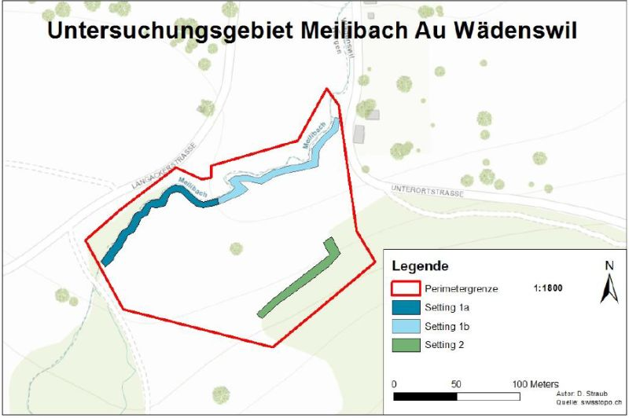

## Feldversuch Au, ZH (2017)

```{r}
trapnights <- read_delim("Data/2017_BA_Straub/Trapnights.csv",";")
levels_group <- c("Priority","Secondary","other")
levels_method <- c("TubeCam","Trackingtunnel","Cameratrap")

trapnights$Method <- factor(trapnights$Method, levels = levels_method, ordered = T)


ggplot(trapnights, aes(Method,Total_Trapnights, fill = Method)) +
  scale_fill_manual(values = zhaw_grad,guide = "none") +
  geom_bar(stat = "identity") +
  geom_text(aes(y = 700, label = paste(c(3,6,12),"Geräte")))+
  labs(y = expression(paste(Sigma," of Trapnights")))+
  theme(axis.text.x=element_text(angle=45, hjust=1)) +
  theme(panel.grid.major = element_blank(), 
        panel.grid.minor = element_blank(),
        panel.background = element_blank(), 
        panel.border = element_rect(colour = "black", fill=NA),
        axis.line = element_line(colour = "black"))
```


## Feldversuch Au, ZH (2017)

```{r}
comparison <- read_delim("Data/2017_BA_Straub/Detektion.csv",";")


comparison %>%
  gather(Method,Individuals,c(TubeCam,Trackingtunnel,Cameratrap)) %>%
  filter(!is.na(Individuals)) %>%
  mutate(
    Group = factor(Group, levels = levels_group,ordered = T),
    Method = factor(Method, levels = levels_method,ordered = T)
  ) %>%
  group_by(Method,Group) %>%
  summarise(
    Nr_of_individuals = sum(Individuals, na.rm = T),
    Nr_of_species = n(),
    Label = paste(unique(Species),collapse = ", ")
  ) %>%
  mutate(
    Label = ifelse(Group != "other",Label,"...")
  ) %>%
  ggplot(aes(Method,y = Nr_of_species, fill = Method)) +
  geom_col() +
  scale_fill_manual(values = zhaw_grad,guide = "none") +

  facet_wrap(~Group) +
  labs(y = "Anzahl Arten",
       x = "Methode",
       title = "Anzahl Nachgewiesene Arten pro Methode",
       subtitle = "Freilandversuch Au, ZH (BA Straub, 2017)") +
  scale_y_continuous(breaks = seq(2,14,2)) +
  theme(axis.text.x=element_text(angle=45, hjust=1))+
  theme(panel.grid.major = element_blank(),
        panel.grid.minor = element_blank(),
        panel.background = element_blank(),
        axis.line = element_line(colour = "black"),
        panel.border = element_rect(colour = "black", fill=NA))


```


## Feldversuch Au, ZH (2017)
```{r}
detektion_zeit <- read_delim("Data/2017_BA_Straub/detektion_zeit.csv",";")

detektion_zeit$Method <- factor(detektion_zeit$Method, levels = levels_method, ordered = T)

# method_colours <- gg_color_hue(3)

ggplot(detektion_zeit, aes(Fallennaechte_summiert,Anzahl_Arten_Summiert, colour = Method)) +
  geom_line() +
  geom_point() +
  lims(x = c(0,640)) +
  scale_y_continuous(breaks = 1:10,limits = c(0,12)) +
  geom_hline(yintercept = 11, lty = 2) +
  annotate("text", x = 0, y = 11, label = "'Ground Truth' (Summierte Artenzahl)", vjust = 0,hjust = 0) +
  labs(title = "Kummulierte Artenzahl über die Fallennächte", 
       subtitle = "Freilandversuch Au, ZH (BA Straub, 2017)",
       x = "Kummulierte anzahl Fallennächte", y = "Kummulierte Artenzahl") +
  theme_classic()

```


<div class="notes">

Die Anzahl Fallennnächte ist aufgrund der Anzahl eingesetzten Methoden sehr unterschiedlich:

- 3 TubeCams
- 6 Fotofallen
- 12 Spurentunnel

</div>

## Zeitplan


## Feldversuch Au, ZH (2018)
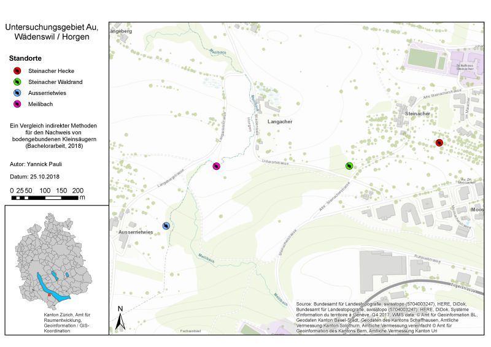

<div class="notes">

- Von jedem System die gleiche Anzahl
- Fotofallen durch "Mostelas" ersetzt


</div>


## Feldversuch Au, ZH (2018)
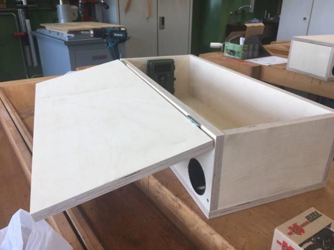

## Feldversuch Au, ZH (2018)
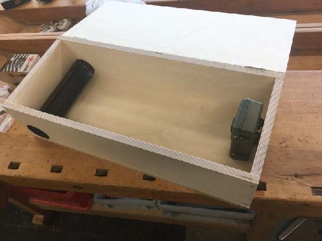

## Feldversuch Au, ZH (2018)
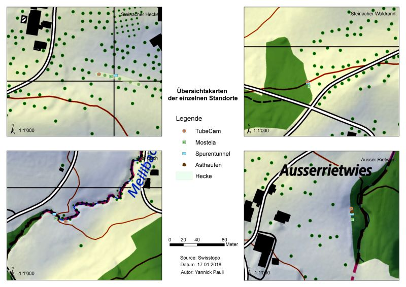


## Feldversuch Au, ZH (2018)
```{r}
pauli2018_methodenvergelich <- read_delim("Data/2018_BA_Pauli/methodenvergleich.csv",";",locale = locale(encoding = "Windows-1252")) %>% 
  gather(key,val,-c(1:2)) %>% 
  separate(key,into = c("Methode","key"),": ") %>%
  mutate(
    val = as.integer(ifelse(val == "-",0,val)),
    Bezeichnung2 = paste0(Familie,"\n(",Bezeichnung,")")
  ) %>%
  spread(key,val)


pauli2018_methodenvergelich %>%
  ggplot(aes(Methode,Standorte)) + 
  geom_col(fill = zhaw_blue1) +
  theme_classic() +
  facet_grid(.~Bezeichnung2) +
  labs(
   title = "Anzahl Standorte mit Nachweisen pro Methode und Tierart",
   subtitle = "Freilandversuch Au, ZH (BA Pauli, 2018)"
    ) +
  theme(axis.text.x=element_text(angle=45, hjust=1),legend.position = "bottom")

```

## Feldversuch Au, ZH (2018)
```{r}

pauli2018_methodenvergelich %>%
  filter(Methode != "Spurentunnel") %>%
  ggplot(aes(Methode,Betretungen)) + 
  geom_col(fill = zhaw_blue1) +
  theme_classic() +
  facet_grid(.~Bezeichnung2) +
  labs(
   title = "Anzahl Betretungen pro Methode und Tierart",
   subtitle = "Freilandversuch Au, ZH (BA Pauli, 2018)"
    ) +
  theme(axis.text.x=element_text(angle=45, hjust=1))

```


## Feldversuch Au, ZH (2018)
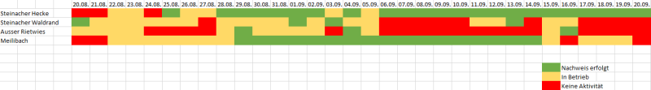

## Feldversuch Au, ZH (2018)
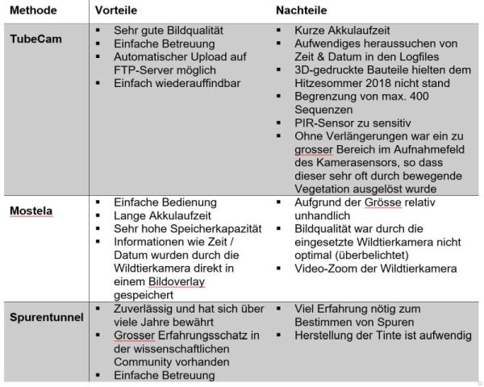


## Feldversuch Rothenthurm (2018)
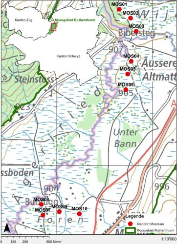

<div class="footer">
Aus Jud (2018): Potenzial von Fotofallen-Boxen für das Kleinsäuger-Monitoring. Bachelorarbeit. ZHAW, Wädenswil.
</div>


## Feldversuch Rothenthurm (2018)
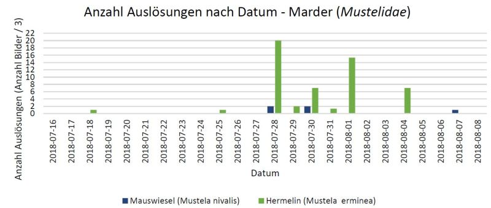


## Feldversuch Rothenthurm (2018)
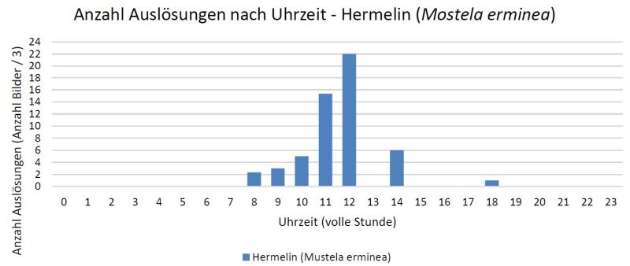

<div class="footer">
Aus Jud (2018): Potenzial von Fotofallen-Boxen für das Kleinsäuger-Monitoring. Bachelorarbeit. ZHAW, Wädenswil.
</div>


## Feldversuch Rothenthurm (2018)
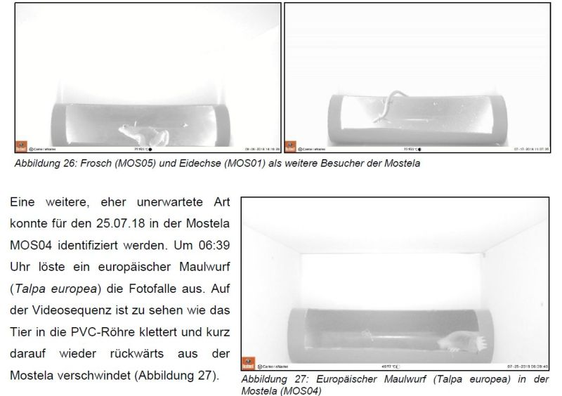

<div class="footer">
Aus Jud (2018): Potenzial von Fotofallen-Boxen für das Kleinsäuger-Monitoring. Bachelorarbeit. ZHAW, Wädenswil.
</div>

## Feldversuch Rothenthurm (2018)
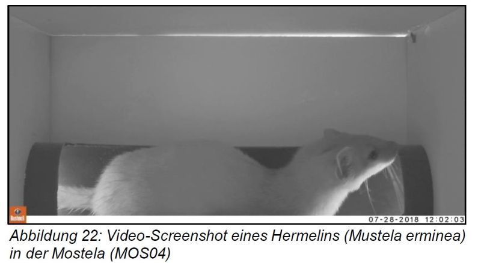

<div class="footer">
Aus Jud (2018): Potenzial von Fotofallen-Boxen für das Kleinsäuger-Monitoring. Bachelorarbeit. ZHAW, Wädenswil.
</div>

## Feldversuch Rothenthurm (2018)
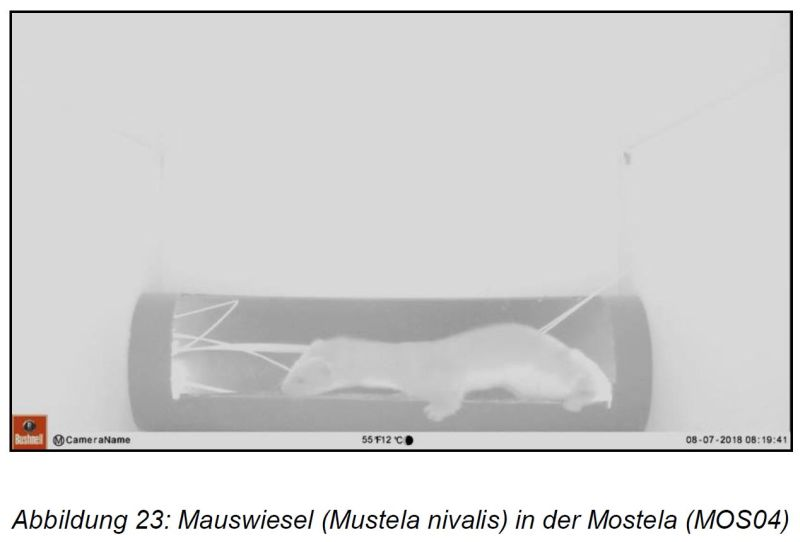

<div class="footer">
Aus Jud (2018): Potenzial von Fotofallen-Boxen für das Kleinsäuger-Monitoring. Bachelorarbeit. ZHAW, Wädenswil.
</div>


## Fazit

- Der Bedarf an alternativen Methoden scheint gross zu sein
- Es gab relativ schnell eine Liste potentieller Abnehmer:
  - Nationalpark Harz (DE)
  - Schweizer Nationalpark
  - Ökobüros CH und NL
  - Vogelwarte, Pronatura


## Fazit

- Technisch haben wir relativ schnell viel erreichen können
- Tests unter Laborbedingungen (Hermelin-Gehege) waren ebenfalls viel versprechend
- die ersten Freilandversuche (2017) zeigten jedoch, dass das Gerät noch sehr weit davon entfernt ist, praxistauglich zu sein
- auch im zweiten Freilandversuch (2018) haben technische Probleme die Datenerhebung dominiert


## Take Home Message

- Wir behalten die Ziele (2016) zur Entwicklung von Nachweismethoden bei
- Wir verfolgen eine neue Strategie und setzen auf die Nutzung bestehender Wildtierkameras
- Die Entwicklung einer eigenen Kamera (TubeCam) wird nicht mehr weiter verfolgt
- Aktuell läuft eine Bachelorarbeit zu diesem Thema


# Angepasstes Versuchdesign Erfolgskontrolle

- Rückblick TubeCam
- Schwerpunkte 2019/2020
  - Weiterentwicklung Nachweismethodik
  - Angepasstes Versuchdesign Erfolgskontrolle
  - Räuber-Beute Dynamik
  - Erhebung von Kleinstrukturen LiDAR
  - Nistkastenmonitoring


## Synthese aus Spurentunnel Erhebungen
>- Wir wissen, dass wir mit jeder Erhebungsmethode die Tiere mit nur sehr geringer Wahrscheinlichkeit detektieren
>- Dieses wissen möchte ich stärker in die Planung und Kommunikation unserer Erfolgskontrollen einfliessen lassen
>- Erster Ansatz: Berechnung der Detektionswahrscheinlichkeit in Abhängigkeit der Zeit


## Erste Auswertung


```{r}
load("Data/2010_CSCF_MustelidMonitoringCH/cscf2010_nest.Rda")

# options(knitr.table.format = "html") 
options(knitr.table.format = "html") 
options("kableExtra.html.bsTable" = T)


cscf2010_sf <- cscf2010_nest %>%
  filter(grepl("erminea",art_full)) %>%
  unnest() %>%
  st_as_sf(coords = c("E","N")) %>%
  st_set_crs(2056)

cscf2010_nest %>%
  slice(1) %>%
  unnest() %>%
  select(-c(art_full,E,N,detect_cum)) %>%
  spread(Woche,detect, sep = "") %>%
  select(1:9) %>%
  head(10) %>%
  # mutate_at(vars(starts_with("Woche")),funs(cell_spec(.,color = ifelse(.==0,"red","black")))) %>%
  kableExtra::kable()

```


## Logistische Regression

```{r}


training_data <- cscf2010_nest %>%
  mutate(
    data = map(data, function(x){
      x %>%
        filter(Woche <= 4)
    })
  )

model_output <- training_data %>%
  mutate(
    logreg_mod = map(data, ~glm(detect_cum ~ Woche, data = .x, family = "binomial")),
    predicted = map(logreg_mod, ~augment(.x,type.predict = "response",newdata = crossing(Woche = seq(0,10,0.1), detect_cum = c(0,1)))),
  )


plot_base <- function(w,slice = 1, addfitted = F, addlines = F){
  model_predicted <- model_output%>%
    slice(slice) %>%
    unnest(predicted)


thresh_lines <- model_predicted %>%
  filter(detect_cum == 1) %>%
  group_by(art_full) %>%
  mutate(min95 = abs(.fitted-0.95), 
         groupmin95 = min(min95)) %>%
  filter(Woche == 6 | min95 == groupmin95) %>%
  mutate(
    text = ifelse(Woche == 6,"Woche 6","90% Threshold")
  )

type_cols <- scales::hue_pal()(2)
names(type_cols) <- c("training","test")

  p <- cscf2010_nest %>%
    slice(slice) %>%
    unnest() %>%
    filter(Woche <= w) %>%
    mutate(type = ifelse(Woche <= 4,"training","test")) %>%
    ggplot(aes(Woche,detect_cum)) + 
    geom_jitter(height = 0.05,width = 0.25,aes(colour = type),size = 1) +
    scale_x_continuous(breaks = 0:10,limits = c(0,10)) +
    scale_colour_manual(values = type_cols) +
    scale_y_continuous(name = "Nachweis",breaks = sort(c(seq(0,1,0.2))),limits = c(0,1)) +
    theme_minimal() +
    facet_grid(art_full~.) +
    theme(legend.position = "none") +
    labs(title = "Ausgehend von den Spurentunnel mit Nachweisen",
         subtitle = "Rohdaten für interne Zwecke von Capt et al (2010) zur Verfügung gestellt")
  if(addfitted){
    p <- p +
      geom_ribbon(data = model_predicted, aes(Woche, ymin = .fitted-.se.fit,ymax = .fitted+.se.fit), alpha = 0.3,colour = "grey") +
      geom_line(data = model_predicted, aes(Woche,.fitted ))
  }
  if(addlines){
    p <- p +
      geom_hline(data = thresh_lines,aes(yintercept = .fitted), lty = 2, colour = "lightgrey") +
      geom_vline(data = thresh_lines, aes(xintercept = Woche), lty = 2, colour = "lightgrey") +
      geom_text(data = filter(thresh_lines,Woche == 6), aes(x = 2, y = .fitted,label = text), hjust = 0) +
      geom_text(data = filter(thresh_lines,Woche != 6), aes(x = Woche, y = 0.2,label = text), hjust = 0,angle = 90) 
      
  }
  return(p)
}


plot_base(0)

```

## Logistische Regression

```{r}
plot_base(1)
```


## Logistische Regression

```{r}
plot_base(2)
```

## Logistische Regression

```{r}
plot_base(3)
```

## Logistische Regression

```{r}
plot_base(4)
```

## Logistische Regression

```{r}
plot_base(5)
```

## Logistische Regression

```{r}
plot_base(6)
```

## Logistische Regression

```{r}
plot_base(7)
```

## Logistische Regression

```{r}
plot_base(8)
```

## Logistische Regression

```{r}
plot_base(4)
```

## Logistische Regression

```{r}
plot_base(4,1,T,F)
```

## Logistische Regression

```{r}
plot_base(4,1,T,T)
```

## Logistische Regression

```{r}
plot_base(4,2,T,T)
```

## Logistische Regression

```{r}
plot_base(4,3,T,T)
```


## Räumzeitliche Autokorrelation

```{r}
cscf2010_nest %>%
  slice(1) %>%
  unnest() %>%
  group_by(KM2) %>%
  mutate(n = length(unique(Tunnel))) %>%
  filter(n > 2) %>%
  ungroup() %>%
  mutate(Tunnel = factor(Tunnel)) %>%
  ggplot(aes(Woche,Tunnel, fill = as.logical(detect)))+
  geom_tile(colour = "black") +
  scale_x_discrete(labels = 1:8) +
  coord_equal() +
  facet_wrap(~KM2) +
  labs(title = "Präsenz / Absenz pro Woche und Tunnel",
       subtitle = "Aufgeteilt nach Kilometerquadrate", fill = "Detection") +
  theme_classic() +
  theme(axis.text.y = element_blank())
```


## Alternative Ansätze

<iframe width="560" height="315" src="https://www.youtube.com/embed/mAcXHpljJ2w?start=36" frameborder="0" allow="accelerometer; autoplay; encrypted-media; gyroscope; picture-in-picture" allowfullscreen></iframe>

## Take Home Message

> - Aus sauber durchgeführte Erhebungen (wie Capt et. al (2010)) lassen sich viele Erkentnisse ziehen
> - Lasst uns unsere Daten zusammenführen und Erkentnisse gewinnen!
> - Lasst uns die "Best practices" für die Durchführung von Wirkungskontrollen (Müri & Weinberger, 2014) erweitern um 
  > - zukünftige Daten ebenfalls nutzen zu können
  > - ein neues Verfahren aufgrund der bisherigen Erfahren vorschlagen?
  
## Take Home Message (II)
> - Datum der Inbetriebnahme notieren!
> - wöchentlich im gleichen Intervall kontrollieren (nachträgliches Diskretisieren ist mit Informationsverlust behaftet)
> - Leere Spurenblätter ebenfalls erfassen
> - "Erfolglose" Spurentunnel ebenfalls erfassen
  


# Räuber-Beute Dynamik

- Rückblick TubeCam
- Schwerpunkte 2019/2020
  - Weiterentwicklung Nachweismethodik
  - Angepasstes Versuchdesign Erfolgskontrolle
  - Räuber-Beute Dynamik
  - Erhebung von Kleinstrukturen LiDAR
  - Nistkastenmonitoring

## Ausgangslage

> - Wir wissen das unsere Zielarten extremen Schwankungen ausgesetzt sind. 
> - Diese Schwankungen werden massgeblich durch die Verfügbarkeit der Beutetieren verursacht
> - Einmalig durchgeführten Erhebungen sollten demnach in den Kontext dieser Schwankungen gesetzt werden
> - Bislang fehlte es an systematischen, quantitativen Erhebungen der Beutetieren
> - Dies hat sich mit dem Start des Projekts "Schermausradar" geändert


## Der Schermausradar

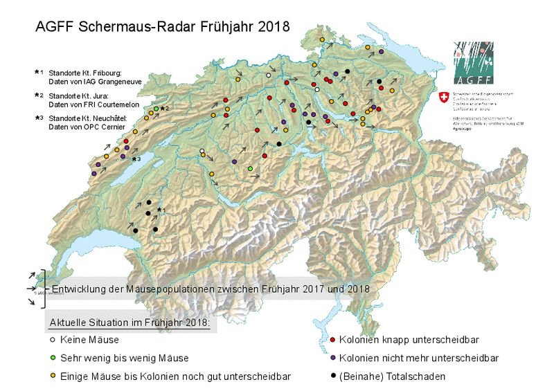

## Mehrjahresschwankungen
```{r}

biogreg <- st_read("Data/2010_Schermausradar/Biogeographische Regionen_LV95/biogreg.shp",quiet= T) %>%
  st_set_crs(2056)

  
schermaus_raw <- read_delim("Data/2010_Schermausradar/Schermausradar 2010-18.csv",";", locale = locale(encoding = "Windows-1252"))

schermaus_processed <- schermaus_raw %>%
  gather(Erhebung,Wert, -Ort) %>%
  mutate(
    Erhebung = parse_date(Erhebung, format = "%B %Y",locale = locale("de")),
    Kanton = stringr::str_sub(Ort,-2,-1)
    ) %>%
    group_by(Ort) %>%
  mutate(
    Wert_norm = (Wert-mean(Wert,na.rm = T))/sd(Wert)
    )


schermaus_koordinaten <- read_delim("Data/2010_Schermausradar/Koordinaten Schermausradarflaechen 2018.csv",";", locale = locale(encoding = "Windows-1252")) %>%
  clean_names()

# schermaus_wide <- schermaus_processed %>%
#   mutate(Jahr = paste0("J_",year(Erhebung))) %>%
#   select(-Erhebung) %>%
#   spread(Jahr,Wert)
  
schermaus_sf <- schermaus_processed %>%
  full_join(schermaus_koordinaten, by = c("Ort" = "ort")) %>%
  st_as_sf(coords = c("koordinate_x","koordinate_y")) %>%
  st_set_crs(21781) %>%
  st_transform(2056)

schermaus_koordinaten <- schermaus_koordinaten %>%
  st_as_sf(coords = c("koordinate_x","koordinate_y")) %>%
  st_set_crs(21781) %>%
  st_transform(2056) %>%
  st_join(biogreg) %>%
  st_set_geometry(NULL) %>%
  select(ort,BIOGREG_R1)

schermaus_sf <-  left_join(schermaus_sf, schermaus_koordinaten, by = c("Ort" = "ort"))
schermaus_processed <- left_join(schermaus_processed, schermaus_koordinaten, by = c("Ort" = "ort"))


schermaus_processed %>%
  group_by(Ort) %>%
  # filter(Ort == "Salenstein TG") %>%
  mutate(
    Wert_norm = (Wert-mean(Wert,na.rm = T))/sd(Wert)
    ) %>% 
  ggplot(aes(Erhebung,Wert_norm)) + 
  geom_line(aes(colour = Ort),alpha = 0.5) + 
  geom_smooth(group = "", lty = 2) +
  labs(title = "Normalisierte Dichtewerte pro Kanton",
       subtitle = "Rohdaten von Agroscope für interne Zwecke Verfügung gestellt",
       y = "Dichtewerte (Mäuse pro ha) normalisiert") +
  facet_wrap(~BIOGREG_R1)  +
  theme_classic() +
  theme(
    axis.text.x=element_text(angle=45, hjust=1),
    legend.position = "none")


```

## Räumliche Verteilung
```{r}


schermaus_sf <- schermaus_sf %>%
  mutate(Jahr = year(Erhebung))

plot_reg <- function(reg,sca = NULL){
  schermaus_sf_filter <- schermaus_sf %>%
  ungroup() %>%
  filter(BIOGREG_R1 == reg)
raster_filter <- get_raster(schermaus_sf_filter,name = "relief_color",turn_greyscale = T,scale_level = sca)
  ggR(raster_filter,alpha = 0.5) +
    geom_sf(data = landesgebiet,fill = NA) +
    geom_sf(data = schermaus_sf_filter, aes(colour = Wert_norm), size = 2) + 
    scale_colour_gradient2(low = "blue",high = "red",midpoint = 0) +
    facet_wrap(~Jahr) +
    coord_sf(crs = 2056, datum = NA) +
    lims_bbox(schermaus_sf_filter) +
    labs(
      title = "Normalisierte Dichtewerte für die Region Jura und Randen",
      subtitle = "Rohdaten von Agroscope für interne Zwecke Verfügung gestellt",
     colour = ""
    ) +
  theme(axis.text = element_blank(),
        axis.title = element_blank(),
     panel.grid = element_blank(), 
      line = element_blank(),
      rect = element_blank()
    )
  
}

plot_reg("Jura und Randen")


```

## Take Home Message

- Durch Agroscope / AGFF (Schermausradar) ist ein Datenfundus vorhanden, mit denen wir Populationsschwankungen unserer Zielarten nachvollziehen und voraussagen können
- Diese Daten könnten für die Planung oder für die Auswertung von Wirkungskontrollen genutzt werden
- Zudem gäbe es ein paar spannde Forschungsfragen, auf die man eifrige Studenten ansetzen könnte

# Erhebung von Kleinstrukturen LiDAR

- Rückblick TubeCam
- Schwerpunkte 2019/2020
  - Weiterentwicklung Nachweismethodik
  - Angepasstes Versuchdesign Erfolgskontrolle
  - Räuber-Beute Dynamik
  - Erhebung von Kleinstrukturen LiDAR
  - Nistkastenmonitoring

## Worum geht es?

Im Laufe unseres Projekts *Wiesel & Co am Zimmerberg* haben wir uns einige Fragen gestellt, über die ihr vermutlich auch schon gestolpert seid. 

> - Wo sind bei uns gut geeignete Wiesel Habitate?
> - Wo sind die Patches und Kernpatches?
> - Wo liegen die Korridore?
> - Wo sind bereits ausreichen Kleinstrukturen vorhanden und wo nicht?


## Worum geht es?

Für Projekte mit einem kleinen Perimeter und/oder mit guten Ortskentnissen lassen sich diese Fragen Adhoc mit Stift und Papier beantworten. 

Ist das Projektgebiet jedoch gross und/oder es fehlen entsprechende Ortskentnisse, kann eine GIS Analyse abhilfe leisten. 

Bisher wurden die Bedürfnisse von Kleinraubtiere relativ schlecht in Geodaten abgebildet. Ich glaube, dies hat sich mit der Einführung von **LiDAR** Daten drastisch geändert.

## Was ist LiDAR?


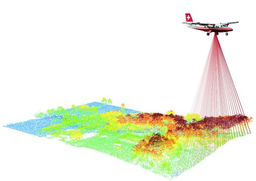

## Was ist LiDAR?

> - LiDAR: **Li**ght **D**etection **a**nd **R**anging
> - Methode zur optischen Abstandsmessung
> - Analog Radar, doch mit Laser anstelle von Radiowellen
> - aus der Lichtlaufzeit der Signale wird die Entfernung zum Ort der Streuung berechnet

## Warum soll LiDAR von Intersse sein?

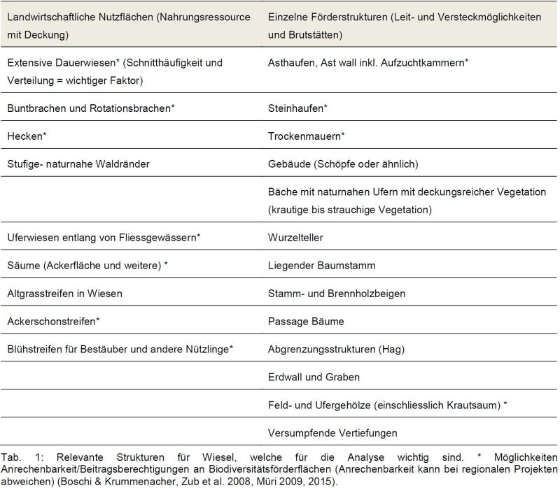


## Wie ist LiDAR verfügbar?

> - Aktuell werden die Daten Kantonal erhoben
> - Unterschiedliche Verfügbarkeit (frei, kostenpflichtig, nicht auffindbar)
> - Unterschiedliche Qualität (Genauigkeit, Auflösung)
> - Zusammenstellung nach einer kurzen Recherche:

## Wie ist LiDAR verfügbar?

```{r}
library(swissvector4r)
library(sf)
library(tidyverse)
library(tmap)
data("kantonsgebiet")
data("seen")

# tm_shape(kantonsgebiet) + tm_polygons(col = "Deutsch")
zusammenstellung_kantone <- read_delim("Data/2017_Scherl/Zusammenstellung_Kantone.csv",delim = ";")

kantonsgebiet <- left_join(kantonsgebiet,zusammenstellung_kantone, by = ("Abk."))
seen_large <- seen %>%
  arrange(desc(SHP_AREA)) %>% 
  head(7)


ggplot(kantonsgebiet, aes(fill = Verfuegbar)) + 
  geom_sf() + 
  geom_sf(data = seen_large, fill = "steelblue3") +
  scale_fill_manual(values = c("palegreen4","grey")) + 
  theme_void() +
  labs(title = "Verfügbarkeit von OpenData LiDAR pro Kanton",
       subtitle = "Quelle: die jeweiligen kantoneln Fachstellen") +
  coord_sf(datum = 2056)
```

## Wie ist LiDAR verfügbar?

- Seit 2017 läuft eine schweizweite Messkampagne
- Punktdichte: 5 bis max 10 Punkte pro m2
- Lagegenauigkeit: 20 cm, Höhengenauigkeit: 10 cm
- Aktueller Zeitplan

## Wie ist LiDAR verfügbar?

```{r}

swisstopo_acqui <- sf::read_sf("Data/2017_Scherl/swisstopo_acquisition.shp") %>%
  st_set_crs(2056)


ggplot(swisstopo_acqui, aes(fill = factor(Jahr_bis))) + 
  geom_sf() + 
  geom_sf(data = seen_large, fill = "lightgrey") +
  theme_void() +
  scale_fill_manual(values = rev(RColorBrewer::brewer.pal(6,"RdYlGn"))) +
  labs(fill = "geplantes Ende") +
  coord_sf(datum = 2056)

```

## Fallbeispiel

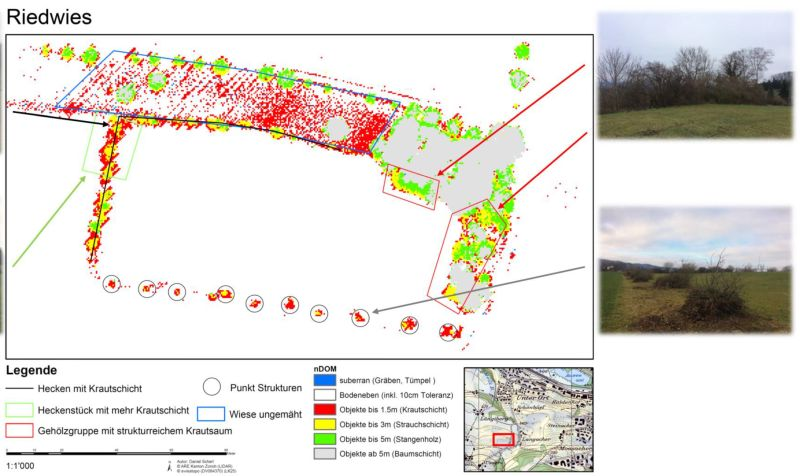


## Fallbeispiel

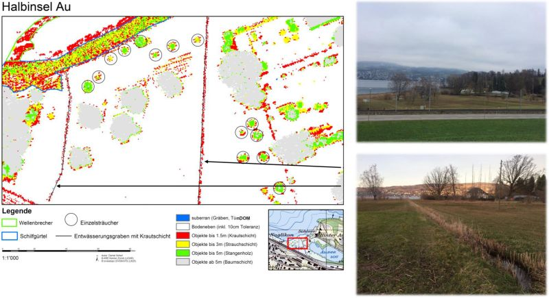


## Take Home Message

> - LiDAR Daten sind bald schweizweit in einheitlicher Qualität verfügbar

> - LiDAR sowie ihre abgeleiteten Produkte bieten grosses Potential für das Verständnis unserer Zielarten und der Landschaft, in der sie leben
<!-- - Mögliche Anwendungsfelder -->
<!--   - Habitatmodellierung: Wo befindet sich geeignete Lebesraum -->


# Nistkastenmonitoring

- Rückblick TubeCam
- Schwerpunkte 2019/2020
  - Weiterentwicklung Nachweismethodik
  - Angepasstes Versuchdesign Erfolgskontrolle
  - Räuber-Beute Dynamik
  - Erhebung von Kleinstrukturen LiDAR
  - Nistkastenmonitoring
  
## Ein paar Eindrücke

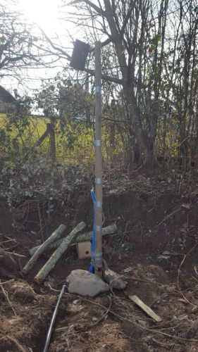

## Ein paar Eindrücke

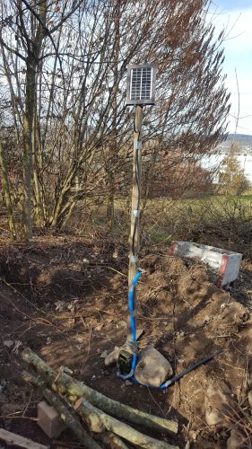

## Ein paar Eindrücke

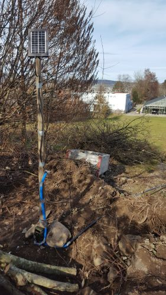


